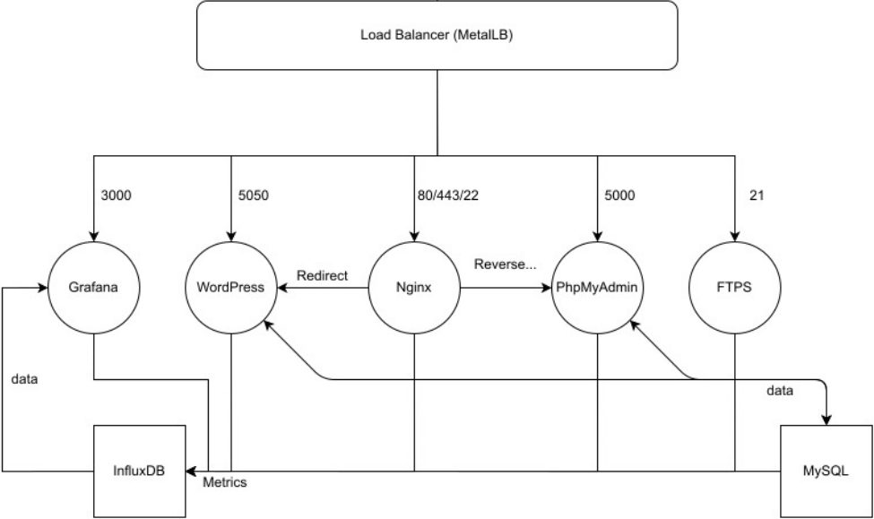

# webOrchestra

I discovered Kubernetes and performed my first web orchestration.

## Functional


- Kubernetes web dashboard
- Load Balancer (MetalLB)
- Nginx
- Website based on WordPress
- phpMyAdmin
- MySQL
- FTPS
- Telegraf
- InfluxDB
- Grafana


## Quick start

```bash
git clone https://github.com/anvv5/webOrchestra.git ; cd webOrchestra ; ./setup.sh ;

```

